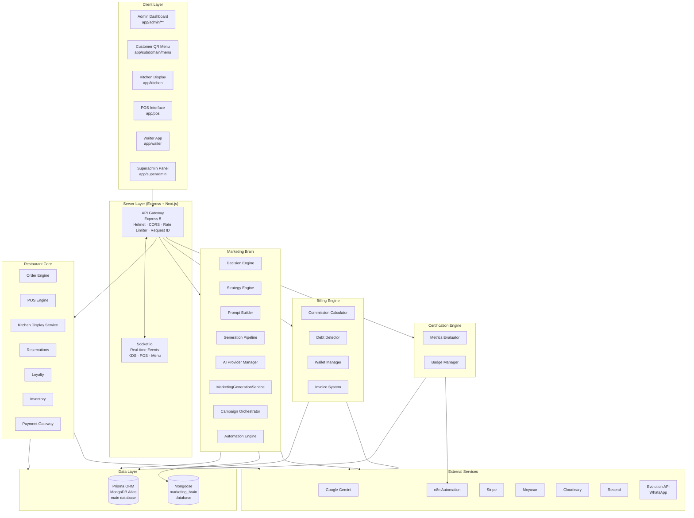
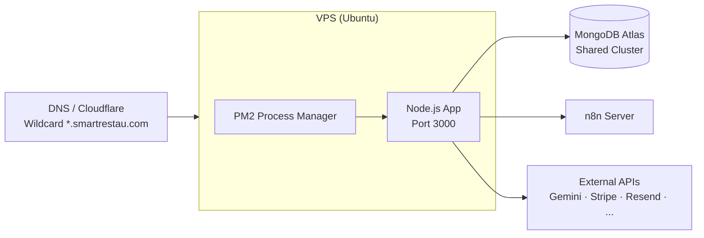

# High-Level Architecture — SmartRestau OS

## System Overview

SmartRestau OS is a multi-tenant SaaS platform for food & beverage businesses in North Africa and the Gulf region. Each tenant (Cafe) is identified by a `subdomain` and isolated at the data layer via `cafeId` scoping on every query.

## Module Inventory

| Module | Status | Purpose |
|---|---|---|
| **Restaurant Core** | ✅ Live | Orders, POS, KDS, tables, reservations, inventory, loyalty |
| **Marketing Brain** | ✅ Live (Phase A–D) | AI-driven lead generation and campaign delivery |
| **Billing Engine** | ✅ Live | Per-order commission, wallet, debt detection, invoicing |
| **Certification Engine** | ✅ Live | Monthly metrics evaluation → Smart Resto Certified badge |
| **AI Center** | ⚙️ Partial | Gemini active; Claude / OpenAI / Groq / OpenRouter as stubs |
| **Analytics** | 🔜 Planned | Cross-tenant insights, cohort analysis, revenue dashboards |
| **Marketplace** | 🔜 Future | Third-party app store for SmartRestau extensions |

## Deployment Topology

- Single VPS running PM2 with the Node.js process
- Next.js SSR served by the same process on port 3000
- MongoDB Atlas handles primary data — replica set enables Change Streams
- `marketing_brain` is a separate database on the same Atlas cluster
- n8n runs as a separate service (self-hosted or n8n Cloud)
