# Module Relationships — SmartRestau OS

## Inter-Module Dependency Graph

```mermaid
graph TD
    subgraph ENTRY["Entry Points"]
        HTTP[REST API<br/>src/routes/**]
        WS[Socket.io<br/>src/socket/handlers.ts]
        CRON[Cron Jobs<br/>src/cron/**]
    end

    subgraph CORE["Restaurant Core"]
        AUTH[Auth Service<br/>src/routes/auth.ts<br/>src/middleware/authorize*.ts]
        ORDERS[Order Engine<br/>src/routes/orders.ts<br/>src/routes/pos/**]
        KDS[KDS Service<br/>src/services/kds.ts]
        BILLING_SVC[Smart Billing<br/>src/services/smartBilling.ts<br/>src/services/billing.ts]
        PAYMENT[Payment Router<br/>src/routes/payment.ts<br/>Stripe · Moyasar · MobileMoney]
        INVENTORY[Inventory<br/>src/routes/inventoryAdmin.ts]
        LOYALTY[Loyalty<br/>src/routes/loyalty.ts]
        RESERVATIONS[Reservations<br/>src/routes/reservations.ts]
        EMAIL[Email Service<br/>src/services/email.ts → Resend]
        CHANGE[Change Streams<br/>src/services/changeStreams.ts]
    end

    subgraph MB["Marketing Brain (src/marketing-brain/)"]
        MB_DE[Decision Engine<br/>decision-engine/]
        MB_SE[Strategy Engine<br/>strategy/]
        MB_PB[Prompt Builder<br/>prompt-builder/]
        MB_GP[Generation Pipeline<br/>generation/]
        MB_AI[AI Provider Manager<br/>providers/]
        MB_GEM[Gemini Adapter<br/>providers/adapters/GeminiAdapter.ts]
        MB_MG[MarketingGenerationService]
        MB_CO[Campaign Orchestrator<br/>CampaignOrchestratorService.ts]
        MB_AE[Automation Engine<br/>automation/AutomationEngineService.ts]
        MB_N8N[N8n Adapter<br/>automation/providers/N8nAdapter.ts]
        MB_SEED[Marketing Brain Seed<br/>seed/]
        MB_KNOW[Knowledge Layer<br/>knowledge/]
        MB_MODELS[(MongoDB Collections<br/>marketing_brain DB)]
    end

    subgraph BILLING["Billing Engine"]
        B_CRON_WEEKLY[Weekly Cron<br/>Mon 23:59<br/>Trial analysis]
        B_CRON_DAILY[Daily Cron<br/>02:00<br/>Debt detection]
        B_CRON_NIGHTLY[Nightly Cron<br/>03:00]
        B_TIERS[Tier Calculator<br/>src/services/billing.ts]
    end

    subgraph CERT["Certification Engine"]
        CERT_CRON[Monthly Cron<br/>1st 02:00<br/>certificationEval.ts]
        CERT_EVAL[Metrics Evaluator]
    end

    subgraph DB["Primary Database"]
        PRIS[(Prisma / MongoDB Atlas<br/>50+ models)]
    end

    subgraph EXTERNAL["External Services"]
        GEMINI_API[Google Gemini API]
        N8N_SRV[n8n Webhooks]
        STRIPE_API[Stripe]
        MOY_API[Moyasar]
        CLD_API[Cloudinary]
        RESEND_API[Resend]
        EVO_API[Evolution API<br/>WhatsApp]
    end

    %% Entry → Core
    HTTP --> AUTH
    HTTP --> ORDERS
    HTTP --> PAYMENT
    HTTP --> INVENTORY
    HTTP --> LOYALTY
    HTTP --> RESERVATIONS
    WS --> CHANGE
    CRON --> B_CRON_WEEKLY
    CRON --> B_CRON_DAILY
    CRON --> B_CRON_NIGHTLY
    CRON --> CERT_CRON

    %% Core internals
    ORDERS --> KDS
    ORDERS --> BILLING_SVC
    PAYMENT --> BILLING_SVC
    AUTH --> EMAIL

    %% Core → DB
    AUTH --> PRIS
    ORDERS --> PRIS
    PAYMENT --> PRIS
    INVENTORY --> PRIS
    LOYALTY --> PRIS
    RESERVATIONS --> PRIS
    BILLING_SVC --> PRIS

    %% Core → External
    PAYMENT --> STRIPE_API
    PAYMENT --> MOY_API
    EMAIL --> RESEND_API
    KDS --> WS
    CHANGE --> WS

    %% Marketing Brain internal
    MB_DE --> MB_KNOW
    MB_SE --> MB_KNOW
    MB_PB --> MB_DE
    MB_PB --> MB_SE
    MB_GP --> MB_PB
    MB_AI --> MB_GEM
    MB_MG --> MB_DE
    MB_MG --> MB_SE
    MB_MG --> MB_PB
    MB_MG --> MB_GP
    MB_MG --> MB_AI
    MB_CO --> MB_MG
    MB_AE --> MB_CO
    MB_AE --> MB_N8N

    %% Marketing Brain → DB
    MB_MG --> MB_MODELS
    MB_CO --> MB_MODELS
    MB_AE --> MB_MODELS

    %% Marketing Brain → External
    MB_GEM --> GEMINI_API
    MB_N8N --> N8N_SRV

    %% Demo request hook
    HTTP -->|"POST /api/public/demo-request<br/>fire-and-forget"| MB_MG

    %% Billing
    B_CRON_WEEKLY --> B_TIERS
    B_CRON_DAILY --> B_TIERS
    B_CRON_DAILY --> N8N_SRV
    B_TIERS --> PRIS

    %% Certification
    CERT_CRON --> CERT_EVAL
    CERT_EVAL --> PRIS
    CERT_EVAL --> N8N_SRV
```



## Key Relationships Explained

### Marketing Brain ↔ Restaurant Core

The only integration point is a **fire-and-forget hook** in `src/routes/demoRequests.ts`:

```
POST /api/public/demo-request
  → prisma.demoRequest.create()   ← synchronous, always returns
  → marketingGenerate().catch()   ← async, never blocks response
```

The Marketing Brain reads nothing from the core Prisma database at runtime. All its data lives in the `marketing_brain` MongoDB database (separate Mongoose connection).

### Automation Engine → n8n

The Automation Engine calls n8n webhooks via `N8nAdapter`. n8n then handles:
- WhatsApp delivery via Evolution API
- CRM updates
- Notification routing

n8n also calls back into SmartRestau (e.g. `POST /api/customers/optin`, `POST /api/marketing/callback`) via verified webhooks.

### Billing ↔ Core

The billing service operates in two modes:
1. **Real-time**: `smartBilling.ts` records commission on every completed order
2. **Batch**: Daily cron at 02:00 sweeps for `PAST_DUE` / `SUSPENDED` states, emits n8n alerts

### Change Streams → Socket.io

When a `Product.price` changes in MongoDB, the Change Stream (`changeStreams.ts`) fires and broadcasts `price_updated` to:
- `room_{cafeId}` — POS cashier screens
- `menu_room_{cafeId}` — Customer QR menu pages

This is the only MongoDB-native event pipeline in the system; all other real-time events go through Socket.io rooms managed by Express routes.
