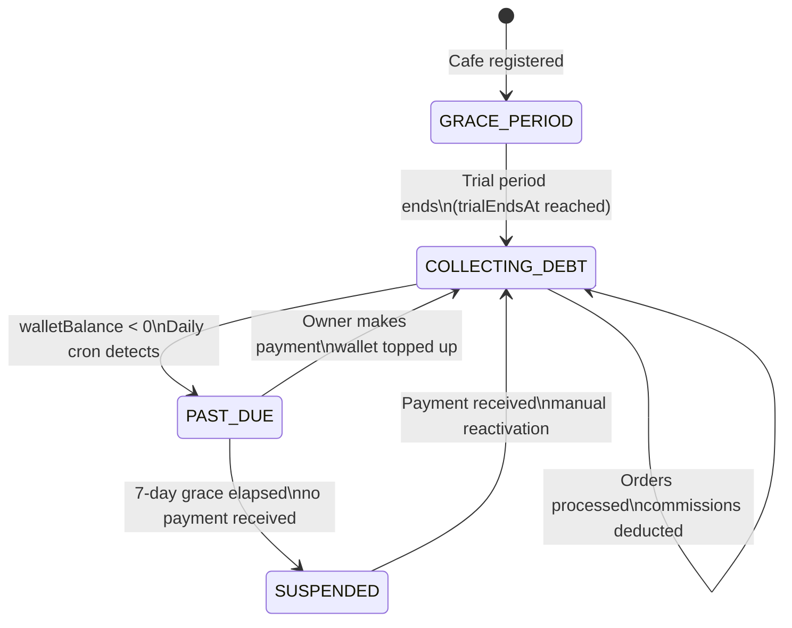
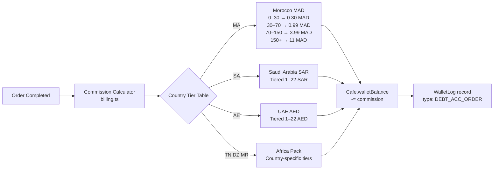
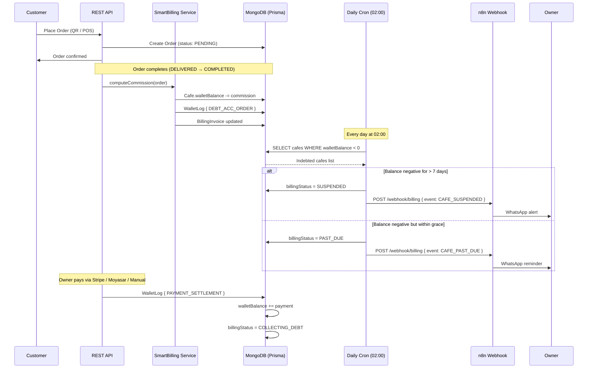

# Billing Lifecycle — SmartRestau OS

## Commission Model

SmartRestau charges per-order commissions that accumulate in each cafe's `walletBalance` (negative = debt). When the wallet goes sufficiently negative the cafe transitions through billing states.

## Billing States



## Commission Tier Structure

Per-order commission is determined by the order total and the cafe's country:



## Cron Schedule

Four cron jobs manage the billing lifecycle:

| Cron | Schedule | File | Purpose |
|---|---|---|---|
| Daily Debt Detection | Every day 02:00 | `cron/dailyDebtDetection.ts` | Sweep `walletBalance < 0` → `PAST_DUE` / `SUSPENDED`; fire n8n alerts |
| Weekly Billing | Mon 23:59 | `cron/weeklyBilling.ts` | Trial expiry analysis; AI billing package generation |
| Nightly | Every day 03:00 | `cron/nightly.ts` | General housekeeping, reporting |
| Certification Eval | 1st of month 02:00 | `cron/certificationEval.ts` | Evaluate all cafes for Smart Resto Certified badge |

## Full Billing Lifecycle



## Payment Methods

| Method | Region | Integration |
|---|---|---|
| Stripe (card / Apple Pay / Google Pay) | Gulf | `src/routes/payment.ts` → Stripe SDK |
| Moyasar | Saudi Arabia, Gulf | `src/routes/payment.ts` → Moyasar REST |
| Orange Money | West Africa | Manual QR / number |
| MTN MoMo | West / Central Africa | Manual QR / number |
| Wave | Senegal, Ivory Coast | Manual QR / number |
| Bank Transfer / Western Union | All regions | Manual confirmation |

## Invoice Records

Every settlement or commission event creates a `BillingInvoice` record:

```
BillingInvoice {
  cafeId · type (COMMISSION | SETTLEMENT) · amount · currency
  orderId (for commissions) · paymentMethod · status · createdAt
}
```

And a `WalletLog`:

```
WalletLog {
  cafeId · type (DEBT_ACC_ORDER | PAYMENT_SETTLEMENT | TRIAL_EXTENSION | DEBT_ACC_SOCIAL)
  amount · balanceAfter · note · createdAt
}
```
