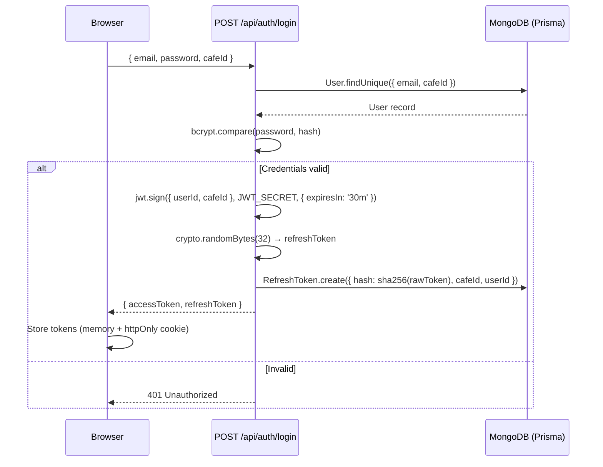
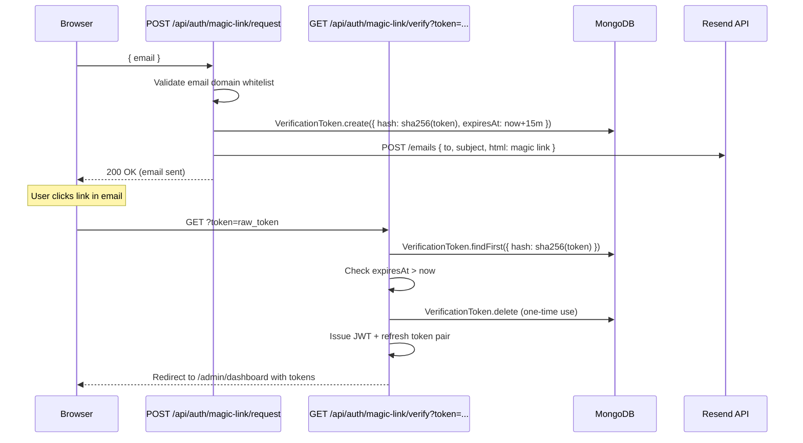
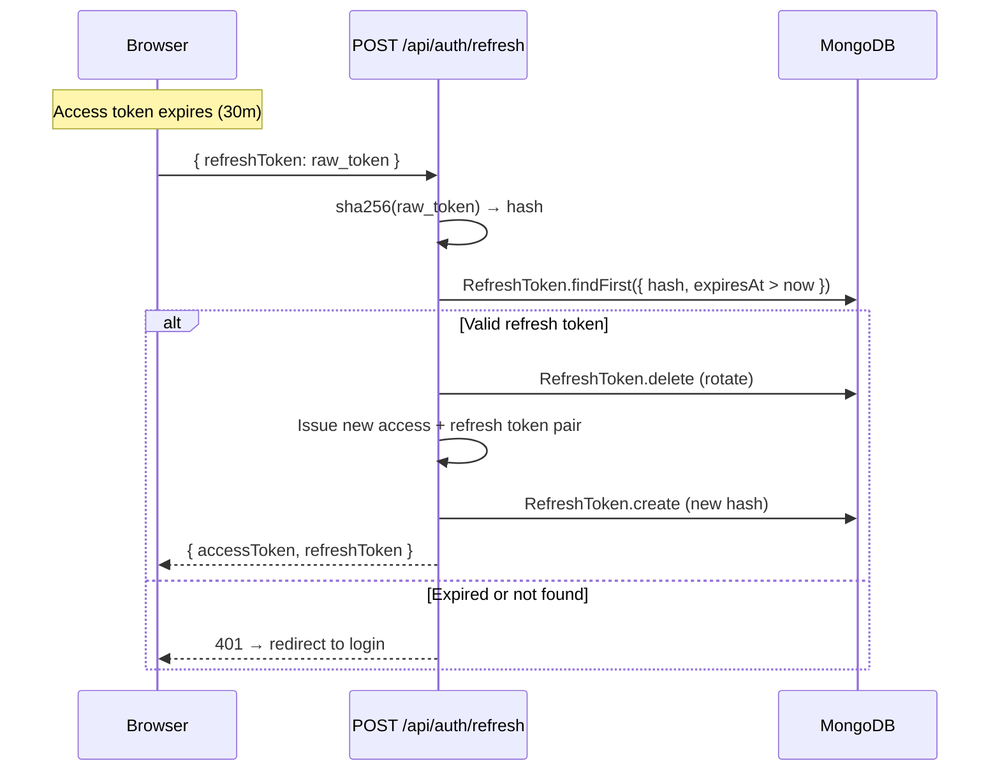
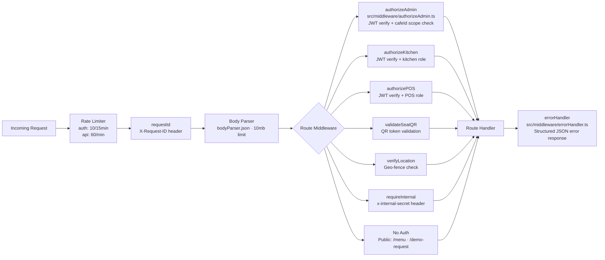

# Authentication Flow — SmartRestau OS

## Authentication Modes

| Mode | Who uses it | Mechanism |
|---|---|---|
| Password login | Admin (cafe owner / staff) | JWT access token + rotating refresh token |
| Magic link | Admin (passwordless) | Secure token emailed via Resend, 15-min TTL |
| QR token | Waiter QR scanning | Short-lived `WaiterQRToken` in DB |
| POS PIN | Cashier / POS | Local device PIN checked against hashed DB value |
| Public routes | Customer QR menu | No auth — scoped by `subdomain` + `tableNumber` |
| Superadmin | Internal ops | `x-superadmin-secret` + `x-superadmin-email` headers |
| Internal service | Cron-to-API | `x-internal-secret` header (`INTERNAL_API_SECRET` env) |
| n8n callbacks | Automation webhooks | `x-n8n-secret` header (`N8N_WEBHOOK_SECRET` env) |

## Standard Login Flow (Password)



## Magic Link Flow



## Token Refresh Flow



## Middleware Stack

Every protected API route passes through one or more middleware:



## JWT Token Structure

```json
{
  "userId": "64a1b2c3d4e5f6a7b8c9d0e1",
  "cafeId": "64a1b2c3d4e5f6a7b8c9d0e2",
  "iat": 1719484800,
  "exp": 1719486600
}
```

- Signed with `JWT_SECRET` (HS256)
- `expiresIn`: 30 minutes (configurable via `ACCESS_TOKEN_EXPIRY` env)
- Refresh token: 30 days (configurable via `REFRESH_TOKEN_DAYS` env)
- Stored as SHA-256 hash only — raw token never persisted

## Multi-Role Authorization

| Middleware | Token claim checked | Additional guard |
|---|---|---|
| `authorizeAdmin` | `userId + cafeId` | Order / body `cafeId` must match token |
| `authorizeKitchen` | `userId + cafeId + role=KITCHEN` | — |
| `authorizePOS` | `userId + cafeId + role=POS` | Shift must be OPEN |
| `validateSeatQR` | `WaiterQRToken` in DB | Token must not be expired |
| `requireInternal` | `x-internal-secret` header | Must match `INTERNAL_API_SECRET` env |
