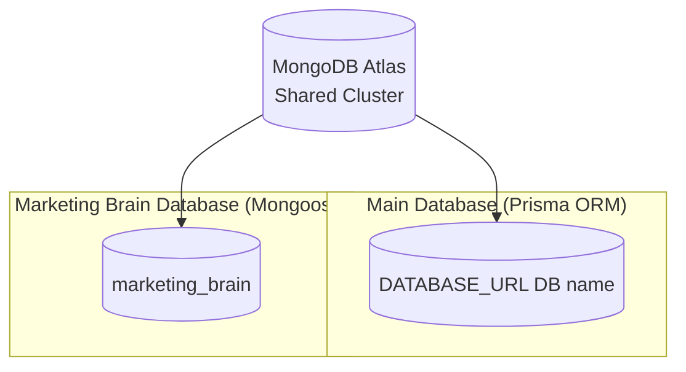
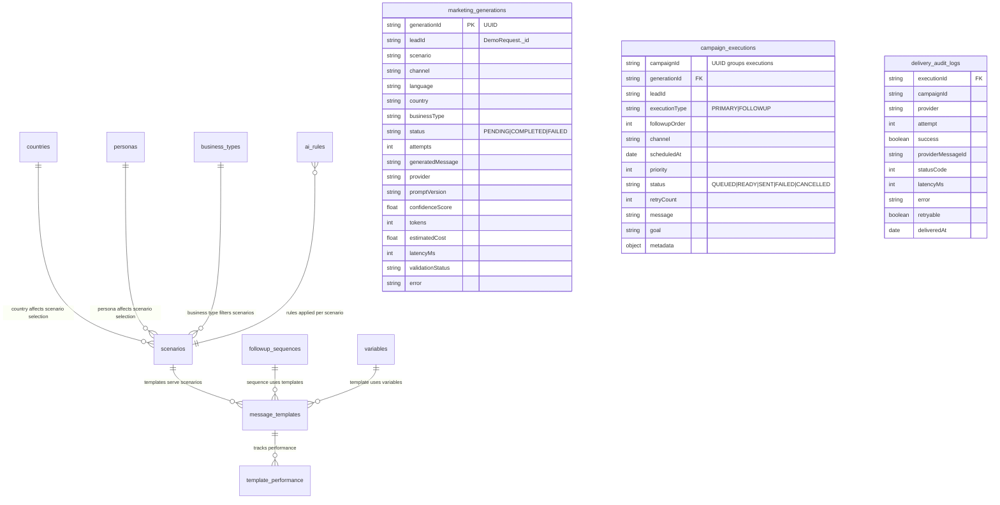
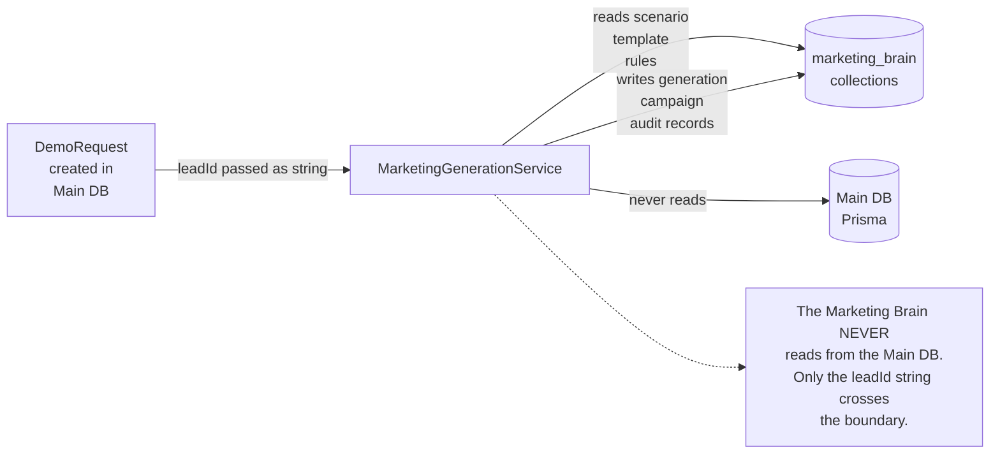

# Database Overview — SmartRestau OS

## Two Databases, One Atlas Cluster

Both databases live in the same MongoDB Atlas cluster but are addressed by separate connections:

| Database | ORM | Connection | Purpose |
|---|---|---|---|
| Main (app DB) | Prisma 4 | `DATABASE_URL` env | All core application data |
| `marketing_brain` | Mongoose 9 | Parsed from `DATABASE_URL`, DB name replaced | AI pipeline models only |

The Marketing Brain connection is managed in `src/marketing-brain/connection.ts` and is idempotent (safe to call multiple times).

## Main Database — Prisma Models

Grouped by domain:

### Tenant

| Model | Key Fields |
|---|---|
| `Cafe` | `id · name · subdomain · country · currency · walletBalance · billingStatus · certificationStatus` |
| `PremiumPlan` | `cafeId · plan · expiresAt` |
| `SiteConfig` | `id · logoUrl · heroUrl · primaryColor · landingEnabled` |

### Orders & POS

| Model | Key Fields |
|---|---|
| `Order` | `id · cafeId · tableId · status · source (QR_CODE / POS_MANUAL) · waiterNotification` |
| `OrderItem` | `orderId · productId · quantity · price · chosenModifiers[]` |
| `BillRequest` | `orderId · status · paymentMethod` |
| `ActiveSession` | `cafeId · tableId · orderId · status` |
| `ClientSession` | `cafeId · tableId · seatId · qrToken · joinedAt` |
| `QrScan` | `cafeId · tableId · scannedAt` |

### Menu

| Model | Key Fields |
|---|---|
| `Category` | `cafeId · name · position` |
| `Product` | `cafeId · categoryId · name · price · modifierGroups[]` |
| `Recipe` | `productId · ingredients[]` |

### Tables & Zones

| Model | Key Fields |
|---|---|
| `Table` | `cafeId · number · zoneId · totalSeats` |
| `Seat` | `tableId · number · qrToken` |
| `Zone` | `cafeId · name · description` |

### Staff

| Model | Key Fields |
|---|---|
| `User` | `cafeId · email · passwordHash · role` |
| `Staff` | `cafeId · name · role (CASHIER/WAITER/SUPERVISOR) · pin` |
| `WaiterQRToken` | `staffId · token · expiresAt` |
| `WaiterShift` | `staffId · cafeId · openedAt · closedAt` |
| `CashierShift` | `staffId · cafeId · status · openedAt` |
| `RefreshToken` | `userId · cafeId · hash · expiresAt` |
| `VerificationToken` | `email · hash · expiresAt` |

### Billing & Payments

| Model | Key Fields |
|---|---|
| `WalletLog` | `cafeId · type · amount · balanceAfter` |
| `BillingInvoice` | `cafeId · type · amount · orderId · status` |
| `BillingTier` | `country · tiers[]` |
| `OnlinePayment` | `cafeId · orderId · method · amount · status · stripeSessionId · moyasarPaymentId` |
| `PaymentRequest` | `cafeId · amount · qrDataUrl · status` |
| `ProcessedWebhook` | `provider · eventId` (idempotency guard) |

### Inventory & Supply Chain

| Model | Key Fields |
|---|---|
| `StockItem` | `cafeId · name · quantity · unit · reorderLevel` |
| `InventorySupplier` | `cafeId · name · contact` |
| `PurchaseOrder` | `cafeId · supplierId · items[]` |
| `SupplierInvoice` | `cafeId · supplierId · amount · dueDate` |
| `PurchaseRequisition` | `cafeId · requestedBy · items[]` |
| `Equipment` | `cafeId · name · purchasedAt · warrantyEnds` |
| `MaintenanceRecord` | `equipmentId · description · cost · date` |

### CRM & Marketing

| Model | Key Fields |
|---|---|
| `Lead` | `cafeId · name · phone · email · status` |
| `DemoRequest` | `ownerName · businessName · businessType · phone · email · city · country · status` |
| `MarketingCampaign` | `cafeId · type · status · sentCount` |
| `CafeCustomer` | `cafeId · phone · whatsappOptIn · optInAt` |
| `LoyaltyAccount` | `cafeId · customerId · points · totalSpent` |

### Reservations & Events

| Model | Key Fields |
|---|---|
| `Reservation` | `cafeId · guestName · date · partySize · status` |
| `Event` | `cafeId · name · date · capacity` |
| `Guest` | `eventId · name · tableNumber · checkedIn` |

### Certification & Compliance

| Model | Key Fields |
|---|---|
| `Cafe.certificationStatus` | Embedded: `PENDING / ELIGIBLE / CERTIFIED / REVOKED` |
| `Cafe.certificationMetrics` | Embedded: `qrUsageRate · avgPrepTime · averageRating · reviewCount` |

### Social & Reviews

| Model | Key Fields |
|---|---|
| `Feedback` | `cafeId · orderId · rating · comment` |
| `ReviewGallery` | `cafeId · imageUrl · approved` |

### Misc

| Model | Key Fields |
|---|---|
| `PrinterLog` | `cafeId · type · payload · sentAt` |
| `FraudAlert` | `cafeId · orderId · type · detectedAt` |
| `SystemNotification` | `cafeId · type · message · read` |

## Marketing Brain Database — Mongoose Collections

### Collection List

| Collection | Mongoose Model | Purpose |
|---|---|---|
| `languages` | `Language` | Supported languages (fr, ar, en, es) |
| `countries` | `Country` | Country metadata (region, currency, comms norms) |
| `business_types` | `BusinessType` | Restaurant / Cafe / Hotel etc. |
| `personas` | `Persona` | Lead persona profiles (owner age, tech comfort, etc.) |
| `scenarios` | `Scenario` | Campaign scenarios (demo_request, followup, reactivation) |
| `objections` | `Objection` | Common objections + AI response templates |
| `message_templates` | `MessageTemplate` | WhatsApp / Email templates with variable slots |
| `followup_sequences` | `FollowupSequence` | Multi-step sequences per scenario |
| `ai_rules` | `AIRule` | Behavioral rules applied by Decision Engine |
| `variables` | `Variable` | Variable definitions (type, source, default) |
| `template_performance` | `TemplatePerformance` | Open/reply/conversion rates per template |
| `marketing_generations` | `MarketingGeneration` | One record per lead generation attempt |
| `campaign_executions` | `CampaignExecution` | One record per scheduled delivery |
| `delivery_audit_logs` | `DeliveryAuditLog` | One record per delivery attempt |

## Data Flow Between Databases

The `leadId` is the only field that crosses the database boundary — it is stored as a plain string in `marketing_generations.leadId` (no foreign key, no join).
