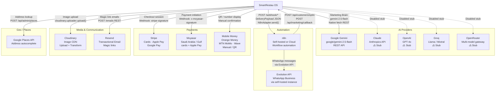

# External Integrations — SmartRestau OS

## Integration Map

## AI Providers

### Google Gemini (Active)

| Property | Value |
|---|---|
| Model | `gemini-2.5-flash` |
| API | `https://generativelanguage.googleapis.com/v1beta/models/{model}:generateContent?key=...` |
| Auth | API key in query string (`GEMINI_API_KEY`) |
| Client | Native `fetch` (Node 20) — no SDK |
| Priority | 1 (highest) |
| Timeout | 30 000 ms |
| Adapter | `src/marketing-brain/providers/adapters/GeminiAdapter.ts` |

**Error handling:**

| HTTP code | Error type | Retryable |
|---|---|---|
| 401 | `ProviderAuthError` | No |
| 429 | `ProviderRateLimitError` | Yes |
| 413 | `ProviderContextTooLongError` | No |
| 5xx | `ProviderServerError` | Yes |
| AbortError | `ProviderTimeoutError` | Yes |
| SAFETY finish | `ProviderSafetyError` | No |

**Pricing (per 1M tokens):**

| Model | Input | Output |
|---|---|---|
| gemini-2.5-flash | $0.15 | $0.60 |
| gemini-2.0-flash | $0.10 | $0.40 |
| gemini-1.5-flash | $0.075 | $0.30 |
| gemini-1.5-pro | $3.50 | $10.50 |

### Future AI Providers (Stubs)

All stubs implement `AIProvider` with `isActive = false`. Enabling a provider requires:
1. Setting `isActive = true` in the adapter
2. Adding its config to `ProviderConfigMap`
3. Providing the API key in `.env`

| Provider | Adapter | Priority |
|---|---|---|
| Claude (Anthropic) | `ClaudeAdapter.ts` | 2 |
| OpenAI | `OpenAIAdapter.ts` | 3 |
| Groq | `GroqAdapter.ts` | 4 (groq-sdk installed) |
| OpenRouter | `OpenRouterAdapter.ts` | 5 |

## Automation — n8n

### Webhook Endpoints Called by SmartRestau

| Env Variable | Trigger | Payload |
|---|---|---|
| `N8N_BILLING_WEBHOOK` | Cafe `PAST_DUE` / `SUSPENDED` | `{ cafeId, event, ownerPhone, balance }` |
| `N8N_WHATSAPP_WEBHOOK` | General WhatsApp notifications | Varies |
| `N8N_MARKETING_WEBHOOK_URL` | Marketing generation callback | Campaign payload |
| `N8N_WEBHOOK_URL` | Customer review submitted | `{ cafeId, rating, comment }` |
| `N8N_WEBHOOK_REVIEW_APPROVED` | Admin approves review | `{ cafeId, reviewId }` |
| `N8N_CERTIFICATION_WEBHOOK_URL` | Certification status change | `{ cafeId, status, metrics }` |
| `N8N_WEBHOOK_URL` (Automation Engine) | Campaign execution delivery | `DeliveryPayload` JSON |

### Webhook Endpoints Called by n8n INTO SmartRestau

| Route | Purpose | Auth |
|---|---|---|
| `POST /api/customers/optin` | WhatsApp opt-in confirmation | `x-n8n-secret` header |
| `POST /api/marketing/callback` | Marketing delivery callback | `MARKETING_CALLBACK_SECRET` |
| `POST /api/whatsapp/webhook` | WhatsApp inbound messages | `EVOLUTION_WEBHOOK_TOKEN` |

## Payments — Stripe

| Feature | Detail |
|---|---|
| Products | Card payments, Apple Pay, Google Pay |
| Region | Gulf (Saudi, UAE, Kuwait, etc.) |
| Integration | Stripe Checkout Session |
| Webhook | `POST /api/payment/gulf/stripe-webhook` |
| Signature | `stripe-signature` header verified with `STRIPE_WEBHOOK_SECRET` |
| Idempotency | `ProcessedWebhook` table guards against duplicate events |
| File | `src/routes/payment.ts` |

## Payments — Moyasar

| Feature | Detail |
|---|---|
| Products | Card + Apple Pay for Saudi Arabia |
| Webhook | `POST /api/payment/moyasar/webhook` |
| Signature | `x-moyasar-signature` header verified |
| Idempotency | `ProcessedWebhook` table |

## Media — Cloudinary

| Feature | Detail |
|---|---|
| Purpose | Cafe logo / hero image / menu product image upload and CDN delivery |
| SDK | `cloudinary` npm package |
| Auth | `CLOUDINARY_CLOUD_NAME` + `CLOUDINARY_API_KEY` + `CLOUDINARY_API_SECRET` |
| Usage | `src/routes/menuAdmin.ts`, `src/routes/publicCafe.ts` |

## Email — Resend

| Feature | Detail |
|---|---|
| Purpose | Magic link delivery for passwordless login |
| Integration | Resend REST API (not SMTP — SMTP silently failed with Gmail relay) |
| From domain | `RESEND_FROM` env (e.g. `noreply@smartrestau.digima.cloud`) |
| Auth | `RESEND_API_KEY` |
| Template | Responsive HTML, RTL-aware (AR / FR / EN / ES) |
| File | `src/services/email.ts` |

## WhatsApp — Evolution API

| Feature | Detail |
|---|---|
| Purpose | Business WhatsApp message delivery |
| Instance | Self-hosted Evolution API |
| Auth | `EVOLUTION_API_KEY` + `EVOLUTION_INSTANCE` |
| Inbound webhook | `POST /api/whatsapp/webhook` verified with `EVOLUTION_WEBHOOK_TOKEN` |
| Used by | n8n (n8n calls Evolution; SmartRestau does not call Evolution directly) |

## Geo — Google Places API

| Feature | Detail |
|---|---|
| Purpose | Address autocomplete on admin onboarding / settings |
| Auth | `GOOGLE_PLACES_API_KEY` |
| Usage | `src/routes/publicCafe.ts` |
