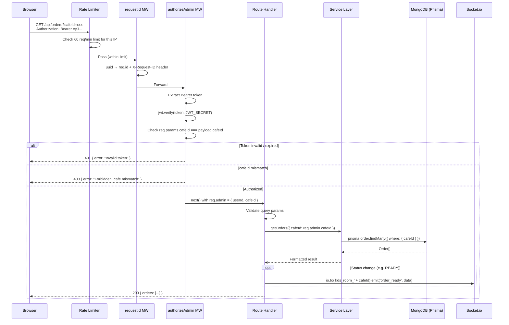
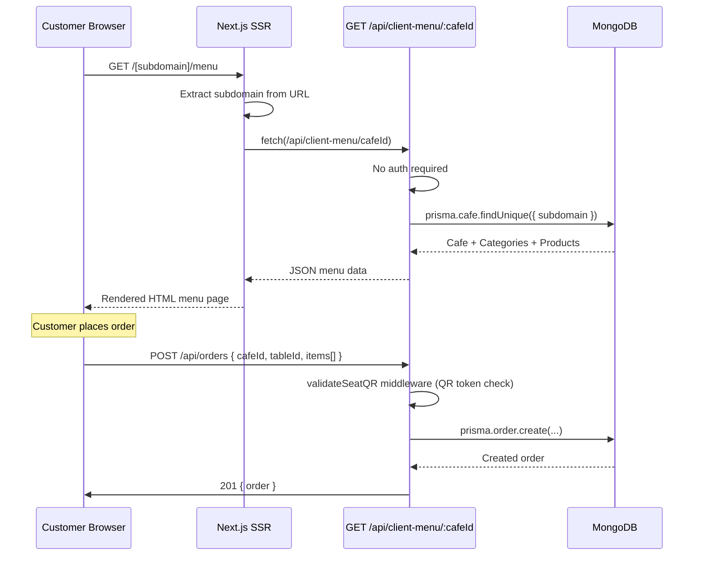
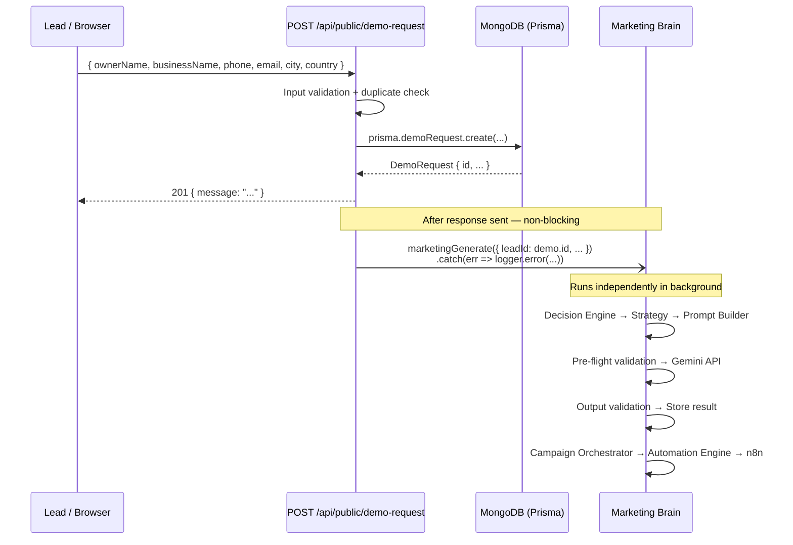

# Request Lifecycle — SmartRestau OS

## Overview

SmartRestau runs Express 5 and Next.js 13 in the same Node.js process. Express handles all `/api/*` routes; Next.js handles everything else (pages, assets).

```mermaid
flowchart TD
    BROWSER([Browser / Mobile App])

    subgraph TRANSPORT["Transport Layer"]
        DNS[DNS → Cloudflare → VPS]
        NGINX[Optional: Nginx reverse proxy\nTLS termination · HTTP/2]
    end

    subgraph EXPRESS["Express 5 Application (src/server.ts)"]
        direction TB

        subgraph SEC["Security Middleware (applied globally)"]
            HLM[Helmet\nHSTS · CSP · X-Frame-Options]
            CORS[CORS\nAllows FRONTEND_URL only\nCredentials: true]
            RL[Rate Limiter\nAuth: 10/15min\nOptIn: 5/hour\nAPI: 60/min]
        end

        subgraph REQ["Request Middleware (per request)"]
            RID[requestId\nX-Request-ID: uuid]
            BODY[bodyParser.json\nLimit: 10mb]
        end

        subgraph ROUTE_MATCH["Route Matching"]
            API{Matches /api/*?}
        end

        subgraph API_ROUTE["API Route Handler"]
            AUTH_MW[Auth Middleware\nauthorizeAdmin /\nauthorizeKitchen /\nauthorizePOS / none]
            VALID[Input Validation\nZod or manual checks]
            HANDLER[Route Handler Function\nasync (req, res) => ...]
        end

        subgraph NEXT["Next.js Handler"]
            NEXTJS[Next.js\nSSR Pages · API Routes · Static]
        end

        EH[Error Handler\nsrc/middleware/errorHandler.ts]
    end

    subgraph SERVICE["Business Service Layer"]
        SVC[Domain Service\nbilling.ts / kds.ts / email.ts / ...]
        MB[Marketing Brain\nMarketingGenerationService]
    end

    subgraph DATA["Data Layer"]
        PRIS[(Prisma → MongoDB Atlas\nMain Database)]
        MONG[(Mongoose → marketing_brain\nMarketing Brain DB)]
    end

    subgraph REALTIME["Real-time Layer"]
        SOCK[Socket.io\nRoom-based events]
    end

    BROWSER --> DNS --> NGINX --> HLM
    HLM --> CORS --> RL --> RID --> BODY --> API

    API -->|Yes| AUTH_MW
    AUTH_MW -->|Authorized| VALID
    VALID -->|Valid| HANDLER
    HANDLER --> SVC
    SVC --> PRIS
    SVC --> MONG
    SVC --> SOCK
    HANDLER --> MB
    MB --> MONG
    HANDLER --> PRIS

    API -->|No /api prefix| NEXTJS
    NEXTJS --> BROWSER

    HANDLER -->|JSON response| BROWSER
    AUTH_MW -->|401/403| BROWSER
    VALID -->|400/422| BROWSER
    SVC -->|throws| EH
    EH -->|500 JSON| BROWSER
```

## Detailed Request Flow — Authenticated API Call



## Public Request Flow — Customer QR Menu



## Fire-and-Forget Pattern — Marketing Brain Integration



## Error Response Format

All Express errors are handled by `src/middleware/errorHandler.ts` and return:

```json
{
  "error": "Human-readable message",
  "requestId": "uuid-from-X-Request-ID-header",
  "code": "OPTIONAL_MACHINE_CODE"
}
```

HTTP status codes used:

| Code | Meaning |
|---|---|
| 200 | Success |
| 201 | Created |
| 400 | Bad request (missing / invalid fields) |
| 401 | Unauthenticated (no token or expired) |
| 403 | Forbidden (wrong cafe, wrong role) |
| 404 | Resource not found |
| 409 | Conflict (duplicate) |
| 422 | Unprocessable entity (validation failed) |
| 429 | Rate limit exceeded |
| 500 | Internal server error |
| 503 | Service unavailable (DB down) |

## Graceful Shutdown Sequence

When `SIGTERM` or `SIGINT` is received:

```
1. Stop cron jobs           (no new scheduled runs)
2. httpServer.close()       (stop accepting new connections, drain in-flight)
3. io.close()               (close WebSocket connections)
4. closeChangeStreams()      (close MongoDB Change Stream cursors)
5. prisma.$disconnect()     (release DB connection pool)
6. process.exit(0)
```
