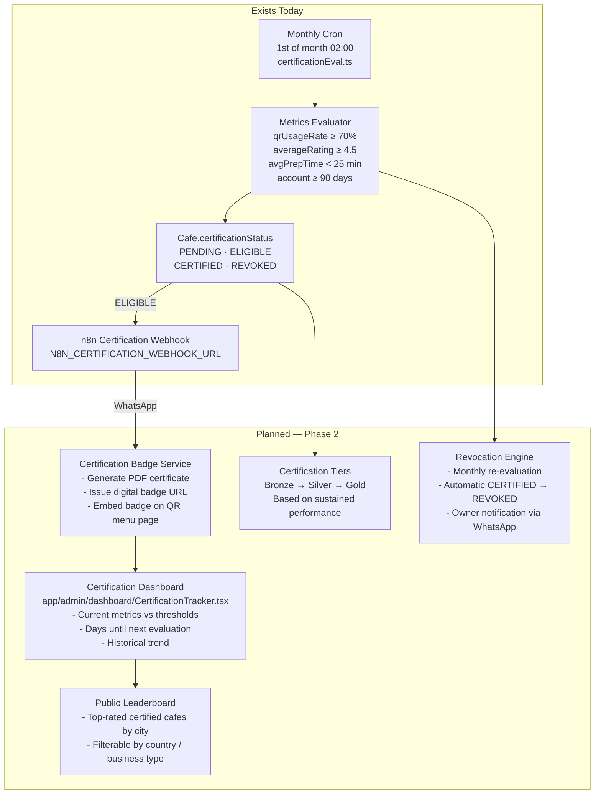
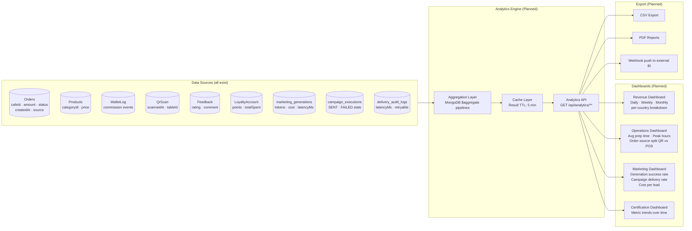
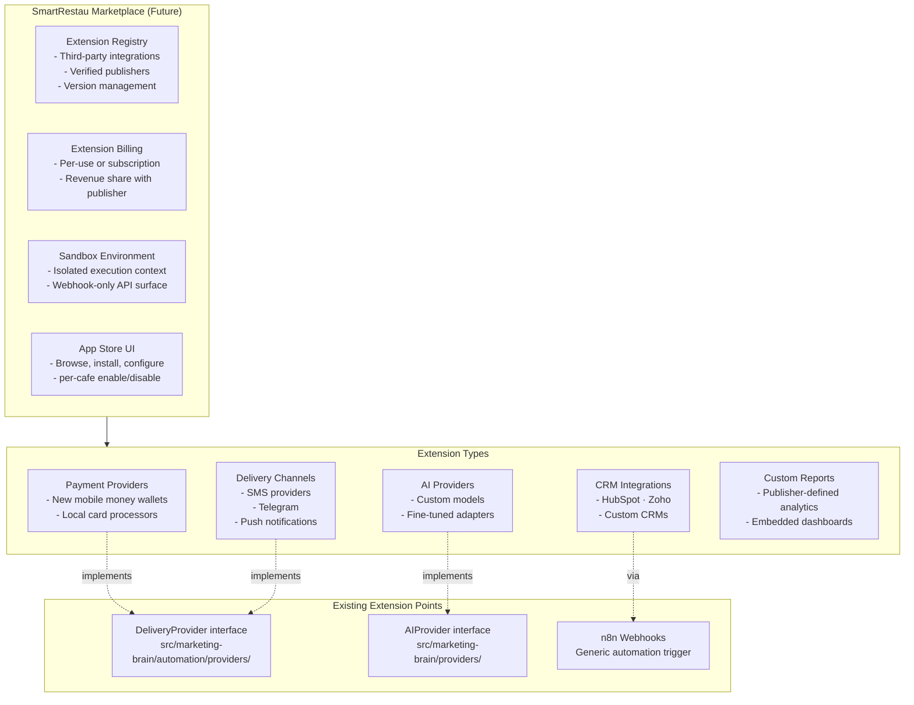
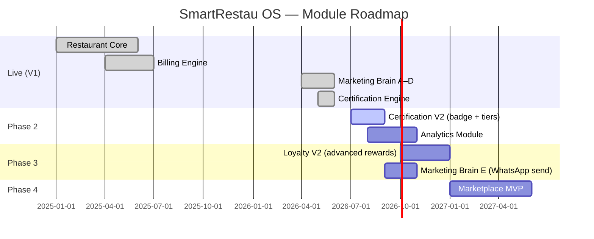

# Future Architecture — SmartRestau OS

> These modules are **not yet built**. This document describes their intended design based on the current architecture patterns and V1 scope freeze.

## Certification Engine (Phase 2)

The Certification Engine's evaluation cron (`certificationEval.ts`) and the `certificationStatus` field on `Cafe` already exist. What is planned:



**Integration points already wired:**
- `app/admin/dashboard/CertificationTracker.tsx` — UI component exists
- `src/routes/adminCertification.ts` — Admin endpoint exists
- `N8N_CERTIFICATION_WEBHOOK_URL` — Env variable in `.env.example`

**What needs to be built:**
- PDF / image certificate generation service
- Public badge endpoint (`GET /api/public/badge/:cafeId`)
- Embedded `CertifiedBadge.tsx` on QR menu (component shell exists)
- Tier progression logic
- Leaderboard page

---

## Analytics Module (Phase 3)



**Key metrics to expose:**

| Metric | Source |
|---|---|
| Revenue per day / week / month | `WalletLog` aggregation |
| Commission rate (%) | `BillingInvoice` + `Order.total` |
| QR vs POS order split | `Order.source` |
| Average prep time | `Order.createdAt` → `Order.preparedAt` |
| Customer return rate | `LoyaltyAccount.totalSpent` trend |
| AI generation cost per lead | `marketing_generations.estimatedCost` |
| Campaign delivery rate | `campaign_executions` SENT / total |
| Top products by revenue | `OrderItem` grouped by `productId` |

---

## Marketplace (Phase 4+)



**Architecture principles for Marketplace:**
- Extensions communicate only via defined interfaces — they cannot access the DB directly
- The `DeliveryProvider` interface (Phase D) and `AIProvider` interface (Phase A) are already the correct extension points
- New payment providers would implement a `PaymentProvider` interface (not yet defined)
- All extensions are webhook-based — no npm packages loaded at runtime

---

## Planned Module Timeline



---

## How to Add a New Delivery Channel

The `DeliveryProvider` interface is already stable. To add a new channel (e.g. SMS, Telegram):

```typescript
// src/marketing-brain/automation/providers/TelegramAdapter.ts

import type { DeliveryProvider, DeliveryResult } from './DeliveryProvider'
import type { ICampaignExecution } from '../../models/CampaignExecution'

export class TelegramAdapter implements DeliveryProvider {
  readonly id       = 'telegram'
  readonly name     = 'Telegram Bot'
  readonly isActive = true

  async send(execution: ICampaignExecution): Promise<DeliveryResult> {
    // POST to Telegram Bot API
    // Return DeliveryResult
  }

  async healthCheck(): Promise<boolean> {
    // Check bot is reachable
  }
}
```

Then register it in `AutomationEngineService`:

```typescript
const engine = new AutomationEngineService({
  providers: [
    new N8nAdapter({ webhookUrl: process.env.N8N_WEBHOOK_URL! }),
    new TelegramAdapter({ botToken: process.env.TELEGRAM_BOT_TOKEN! }),
  ],
})
```

## How to Activate a New AI Provider

All AI provider stubs are already registered. To activate Claude:

1. Set `isActive = true` in `ClaudeAdapter.ts`
2. Add `CLAUDE_API_KEY` to `.env`
3. Pass `claude: { apiKey: process.env.CLAUDE_API_KEY }` to `createAIProviderManager()`

The fallback chain (`Gemini → Claude → OpenAI → Groq → OpenRouter`) will automatically try Claude if Gemini fails.
